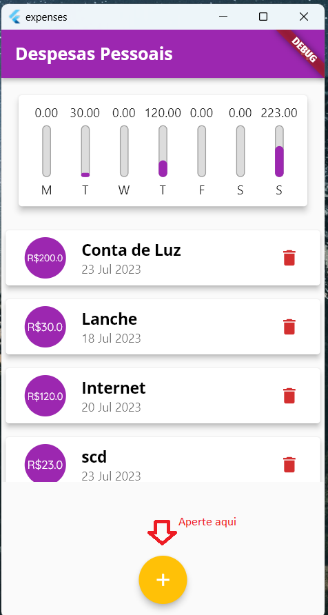

# Despesas pessoais
Este projeto apresenta uma lista de despesas pessoais onde é possível cadastrar os gastos durante uma semana, desta forma é possivel ter uma ideia do quanto é gasto e em qual dia houve mais gastos.

## Primeiro passos
- Baixar a aplicação

```
git clone https://github.com/KaremSouza12/expenses.git
```

- Para baixar os pacotes instalados utilize o comando a baixo:

```
flutter pub get
```
### O que foi utilizado na implementação

```
dart: 3.0.0
Flutter: 3.10.0
Visual Estudio Code: 1.8.0

Para subir as alterações pro repositório
git: 2.36.1
```
## Como usar 

 

